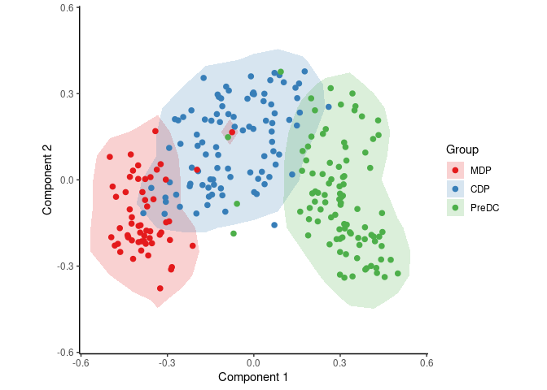

# SCORPIUS

<!-- badges: start -->

[](https://github.com/rcannood/SCORPIUS/actions/workflows/R-CMD-check.yaml)
[](https://cran.r-project.org/package=SCORPIUS)
[](https://app.codecov.io/gh/rcannood/SCORPIUS?branch=master)
<!-- badges: end -->

SCORPIUS an unsupervised approach for inferring linear developmental
chronologies from single-cell RNA sequencing data. In comparison to
similar approaches, it has three main advantages:

-   **It accurately reconstructs linear dynamic processes.** The
    performance was evaluated using a quantitative evaluation pipeline
    and ten single-cell RNA sequencing datasets.

-   **It automatically identifies marker genes, speeding up knowledge
    discovery.**

-   **It is fully unsupervised.** Prior knowledge of the relevant marker
    genes or cellular states of individual cells is not required.

News:

-   See `news(package = "SCORPIUS")` for a full list of changes to the
    package.

-   Our preprint is on
    [bioRxiv](https://biorxiv.org/content/early/2016/10/07/079509)
    (Cannoodt et al. 2016).

-   Check out our [review](https://dx.doi.org/10.1038/s41587-019-0071-9)
    on Trajectory Inference methods (Saelens et al. 2019).

## Installing SCORPIUS

You can install:

-   the latest released version from CRAN with

    ``` r
    install.packages("SCORPIUS")
    ```

-   the latest development version from GitHub with

    ``` r
    devtools::install_github("rcannood/SCORPIUS", build_vignettes = TRUE)
    ```

If you encounter a bug, please file a minimal reproducible example on
the [issues](https://github.com/rcannood/SCORPIUS/issues) page.

## Learning SCORPIUS

To get started, read the introductory example below, or read one of the
vignettes containing more elaborate examples:

-   Running SCORPIUS on an AnnData object:  
    `vignette("anndata", package="SCORPIUS")`
-   Investigating dendritic cell maturation in dendritic cell
    progenitors:  
    `vignette("ginhoux", package="SCORPIUS")`
-   Running SCORPIUS on a Seurat object:  
    `vignette("seurat", package="SCORPIUS")`
-   Trajectory inference from simulated data:  
    `vignette("simulated-data", package="SCORPIUS")`

## Introductory example

This section describes the main workflow of SCORPIUS without going in
depth in the R code. For a more detailed explanation, see the vignettes
listed below.

To start using SCORPIUS, simply write:

``` r
library(SCORPIUS)
```

The `ginhoux` dataset (Schlitzer et al. 2015) contains 248 dendritic
cell progenitors in one of three cellular cellular states: MDP, CDP or
PreDC. Note that this is a reduced version of the dataset, for packaging
reasons. See ?ginhoux for more info.

``` r
data(ginhoux)
expression <- ginhoux$expression
group_name <- ginhoux$sample_info$group_name
```

With the following code, SCORPIUS reduces the dimensionality of the
dataset and provides a visual overview of the dataset. In this plot,
cells that are similar in terms of expression values will be placed
closer together than cells with dissimilar expression values.

#### Note: if the `group_name` is not a factor, convert it to factor using `prog_col_to_factor(group_name)`

``` r
space <- reduce_dimensionality(expression, "spearman")
draw_trajectory_plot(space, group_name, contour = TRUE)
```

<!-- -->

To infer and visualise a trajectory through these cells, run:

``` r
traj <- infer_trajectory(space)
draw_trajectory_plot(space, group_name, traj$path, contour = TRUE)
```

<!-- -->

To identify candidate marker genes, run:

``` r
# warning: setting num_permutations to 10 requires a long time (~30min) to run!
# set it to 0 and define a manual cutoff for the genes (e.g. top 200) for a much shorter execution time.
gimp <- gene_importances(
  expression, 
  traj$time, 
  num_permutations = 10, 
  num_threads = 8, 
  ntree = 10000,
  ntree_perm = 1000
) 
```

To select the most important genes and scale its expression, run:

``` r
gimp$qvalue <- p.adjust(gimp$pvalue, "BH", length(gimp$pvalue))
gene_sel <- gimp$gene[gimp$qvalue < .05]
expr_sel <- scale_quantile(expression[,gene_sel])
```

To visualise the expression of the selected genes, use the
`draw_trajectory_heatmap` function.

``` r
draw_trajectory_heatmap(expr_sel, traj$time, group_name)
```

<!-- -->

Finally, these genes can also be grouped into modules as follows:

``` r
modules <- extract_modules(scale_quantile(expr_sel), traj$time, verbose = F)
draw_trajectory_heatmap(expr_sel, traj$time, group_name, modules)
```

<!-- -->

## References

<div id="refs" class="references csl-bib-body hanging-indent">

<div id="ref-Cannoodt2016" class="csl-entry">

Cannoodt, Robrecht, Wouter Saelens, Dorine Sichien, Simon Tavernier,
Sophie Janssens, Martin Guilliams, Bart Lambrecht, Katleen De Preter,
and Yvan Saeys. 2016. “SCORPIUS Improves Trajectory Inference and
Identifies Novel Modules in Dendritic Cell Development,” October.
<https://doi.org/10.1101/079509>.

</div>

<div id="ref-Saelens2019" class="csl-entry">

Saelens, Wouter, Robrecht Cannoodt, Helena Todorov, and Yvan Saeys.
2019. “A Comparison of Single-Cell Trajectory Inference Methods.”
*Nature Biotechnology* 37 (5): 547–54.
<https://doi.org/10.1038/s41587-019-0071-9>.

</div>

<div id="ref-Schlitzer2015" class="csl-entry">

Schlitzer, Andreas, V Sivakamasundari, Jinmiao Chen, Hermi Rizal Bin
Sumatoh, Jaring Schreuder, Josephine Lum, Benoit Malleret, et al. 2015.
“Identification of <span class="nocase">cDC</span>1- and <span
class="nocase">cDC</span>2-Committed DC Progenitors Reveals Early
Lineage Priming at the Common DC Progenitor Stage in the Bone Marrow.”
*Nature Immunology* 16 (7): 718–28. <https://doi.org/10.1038/ni.3200>.

</div>

</div>
